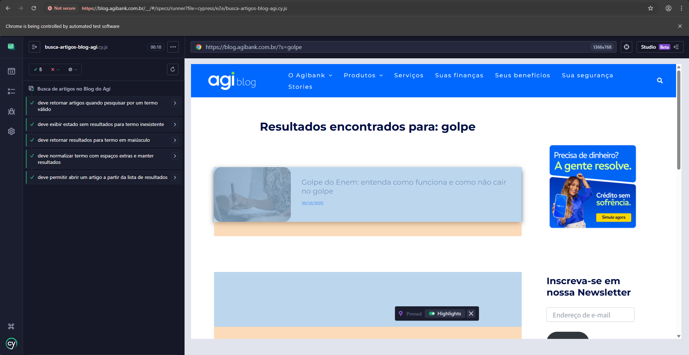

# Teste Técnico QA Web - Blog do Agi

Projeto de automação E2E com Cypress para validar a funcionalidade de pesquisa de artigos no Blog do Agi (`https://blogdoagi.com.br/`).

## 🚀 Cenários automatizados

Foram automatizados cenários relevantes da busca de artigos:

1. **Busca com termo válido**
   - Objetivo: garantir que usuários encontrem conteúdo quando pesquisam por um tema comum.
   - Validações:
     - URL contém o parâmetro de busca.
     - Há listagem de resultados (artigos/links).

2. **Busca com termo inexistente**
   - Objetivo: garantir comportamento correto em caso de pesquisa sem correspondência.
   - Validações:
     - URL contém o termo pesquisado.
     - Página exibe mensagem de ausência de resultados.

3. **Busca com variação de caixa (maiúsculas)**
   - Objetivo: validar robustez da pesquisa para diferentes formas de digitação.
   - Validações:
     - Resultado da busca é exibido normalmente.
     - Existem links de artigos na listagem.

4. **Busca com espaços extras no termo**
   - Objetivo: validar normalização de entrada do usuário.
   - Validações:
     - Parâmetro de busca é processado na URL.
     - Resultados são retornados.

5. **Abertura de artigo a partir dos resultados**
   - Objetivo: garantir continuidade do fluxo de navegação pós-busca.
   - Validações:
     - Primeiro resultado possui link válido.
     - Página do artigo abre com título visível.

## ✅ Resultados dos Testes
Abaixo, a evidência da execução bem-sucedida de todos os cenários automatizados:

<div align="center">
  
</div>

## 🛠️ Stack

- Node.js
- Cypress
- GitHub Actions (execução em CI)

## 📋 Pré-requisitos

- Node.js 18+ (recomendado 20)
- npm

## ⚙️ Instalação

```bash
npm install
```
```bash
npx cypress install
```

## Execução dos testes

### Modo headless

```bash
npm run cy:run
```

### Modo interativo

```bash
npm run cy:open
```

## 📂 Estrutura

- `cypress/e2e/busca-artigos-blog-agi.cy.js`: testes E2E da busca
- `cypress/fixtures/`: Dados de entrada e saída esperadas 
- `cypress.config.js`: configuração do Cypress
- `.github/workflows/cypress.yml`: pipeline para execução automatizada no GitHub Actions

## CI

Ao realizar `push` ou abrir `pull request`, o workflow `Cypress E2E` executa os testes automaticamente no GitHub Actions.
